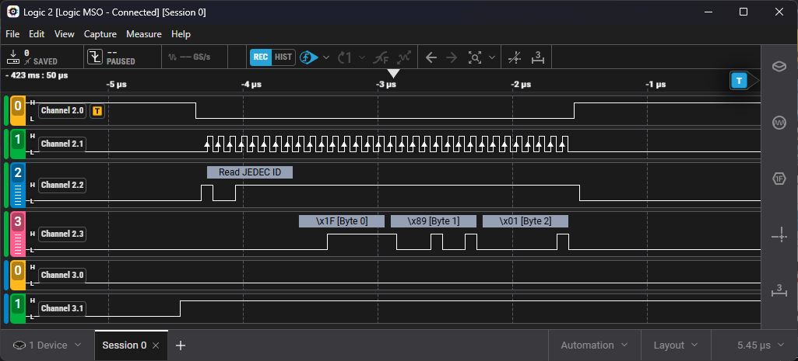
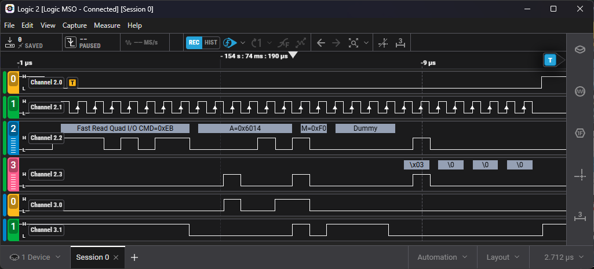
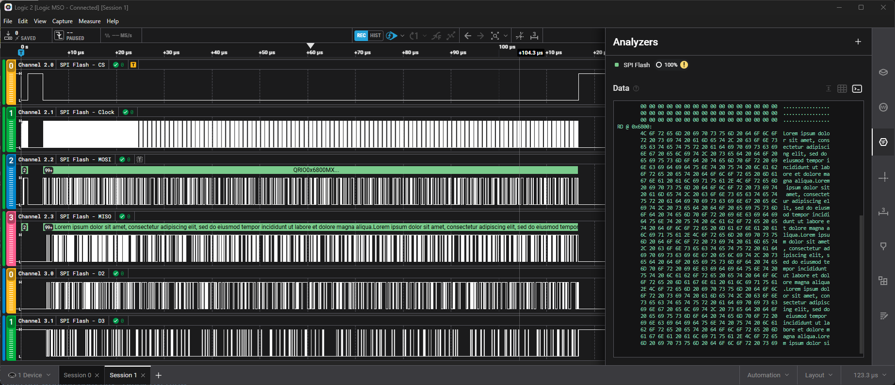
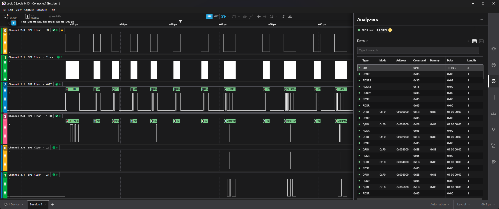
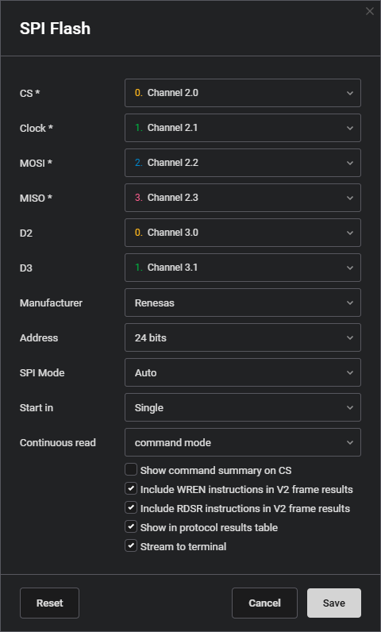

# SPI Flash Analyzer Plugin

A SPI Flash Analyzer Plugin for Saleae Logic software.

> [!NOTE]
> The lookup tables are undergoing a complete review and rework to help improve
> compatibility and future extension. During this time some instructions may
> not function/decode correctly. Some possible areas that may not work as
> intended are: dummy byte/cycle handling on a per vendor/config basis,
> determination of which commands are supported by QPI and/or SPI mode.

## Features

- [X] Support single, dual, and quad-line SPI mode
- [X] Support QPI mode (command sent over 4-lanes)
- [X] Support DTR mode (command sent over 2-lanes)
- [X] Handles dynamic changing between SPI and QPI mode based on commands
- [X] Decodes status register bit fields
- [X] SPI0 and SPI3 mode
- [X] Continuous read mode handling
- [X] FrameV2 format supported
- [X] Support raw read/write data dump to tabular text

The following manufacturers command sets are supported:
  - Winbond
  - Macronix
  - Renesas
  - GigaDevice
  - Adesto
  - Microchip
  - Micron
  - Cypress
  - Issi
  - Fujitsu

Capture showing JEDEC ID

Capture showing Quad Read I/O

Capture showing simplified raw-data terminal output

Capture showing the decoded protocol table

Settings

## Known Issues

- The Saleae Logic framework does not officially support multiple bubble-text
  entires that overlap in time. The current chip select behavior breaks this rule
  and as a result causes some graphical anomalies in the rendering of the
  bubble-text. The primary observable issue is that some bubble text may not
  expand out to their more detailed representations. To resolve this a setting
  is added to enable/disable the command-summary feature that uses the
  chip-select line to provide a basic overview of the transaction. This feature
  is disabled by default.
- Rerunning the analyzer seems to generate an extra terminal output row for the
  final line. This may manifest itself in other locations. This issue has not
  been investigated in great detail yet to know if this is an issue of the
  Logic software itself or the plugin.
- The plugin makes use of at least one global variable which may result in
  abnormal behavior in multi-instance usage.
- Dummy bits are likely not handled correctly in some use-cases. Some modes
  may depend on a settings register to determine correct dummy-cycle setting,
  some commands depend on SPI/DPI/QPI modes, others may depend on communication
  frequency. It is likely the plugin will require additional user-settings to
  provide required flexibility for initial state and then monitor for changes at
  run time.

## Bug Reporting & Feature Requests

If you see a problem with how the plugin decodes data, is missing information,
or you would like to see support for another type of serial flash memory please
create a GitHub issue.

## Attribution

Much of this work was originally based on the `saleae_spi_flash` originally authored
Jerzy Kasenberg at https://github.com/kasjer/saleae_spiflash. The work done
in this project is very much appreciated and is deserving of recognition.
Additional contributors include: Jonathan Zentgraf and Ian Rees.

## License

Copyright © Jon Carrier

This project is licensed under the MIT license. For more details please refer to
[LICENSE](./LICENSE).
